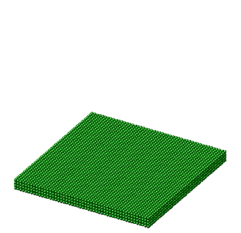

Alloy Application for SPPARKS

This application performs kinetic Monte Carlo simulations for the diffusion and deposition of multi-elemental atoms. You can get an example script up and running in a few minutes by following my quick start guide in the html documentation. If you are not familar with SPPARKS scripting you can find information about it at https://spparks.sandia.gov/. 